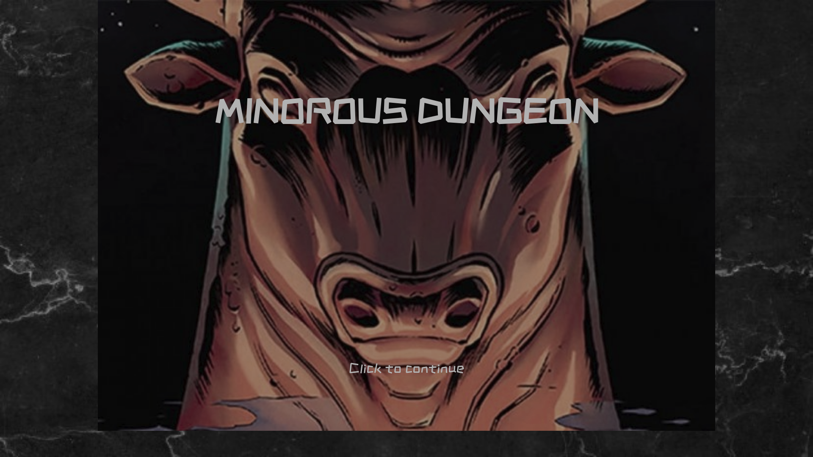

# Minorou's Dungeon
-------------------------

Minorou's Dungeon is a horror game based with a lot games easter-eggs. You can choose the character you want to play and go inside the dungeon with 6 minotaurs to get the treasure to win the game.

## Developer
-------------------------

Arthur Santoianni Barazzone Durant

### Game instructions:
-------------------------

First you can chose your character, but you can only play with the bonus char, if you get the minimum aumount of treasure to buy and unlock them. 

The game is simple, you start in a random place inside the dungeon and you should go fast seek for the treasure, because the minotaus can run faster than you and it becomes hard to find it before they caught you!

Unless you get the treasure, you can escape the dungeon and win the game! Becareful, the minotaurs are so fast and hungry! Good luck xD!

### Used technologies:
-------------------------

* Javascript
* HTML
* CSS

### Installation instructions:
------------------------------

You can view my project in your browser:

$ git clone https://github.com/arthsan/minorous-dungeon.git
$ cd minorous-dungeon

Then click on the index.html file and open it in your browser. Have fun!!

The game is also on GitHub Pages : [minorou's dungeon](https://arthsan.github.io/minorous-dungeon/)

### Unsolved problems:
-------------------------

* Unlock Characters
* Uncompleted labyrinth
* Not fluid gameplay
* Add 2 players game modality.

